# Rendu Traffic Réseau

## Mon adresse IP de classe C + Gateway

    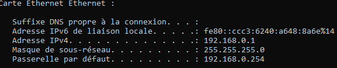

    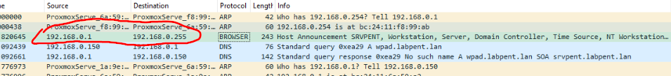

    

## 0. Flags TCP

### La poignée de main SYN ACK

    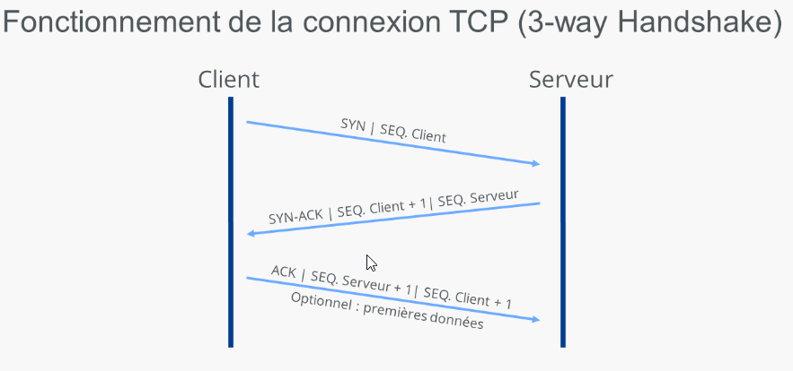

### FIN pour la fermeture de connexion
### RST pour la réinitialisation de la connexion
### PSH pour l'indication que les données doivent etre transmise immédiatement
### URG pour l'indication que les données sont prioritaires

## 1.Capture processus DORA du DHCP

    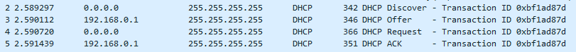

## 2. DHCP Starvation / Snooping / Rogue

### Starvation : Attaque qui épuise le pool d'adresses IP d'un serveur DHCP en envoyant de fausses demandes DHCP pour empêche les clients légitimes d'obtenir des adresses IP, perturbant ainsi le réseau.

### Snooping : Technique de sécurité pour empêcher les attaques DHCP malveillantes, comme Starvation et Rogue. 

### Rogue : Serveur DHCP non autorisé installé sur un réseau. Utilisé pour distribuer de fausses informations de configuration aux clients du réseau, les redirigeant vers des services malveillants ou interceptant leur trafic réseau.

## 3. ipconfig /release (windows) / Enjeu Sécurité

### La commande "ipconfig /release" Windows est utilisée pour libérer l'adresse IP attribuée à la carte réseau. Cette commande envoie un message DHCPRELEASE au serveur DHCP pour l'informer que l'adresse IP attribuée n'est plus utilisée. Cela permet au serveur DHCP de récupérer cette adresse IP et de la réattribuer à un autre ordinateur du réseau si nécessaire.

### Côté sécurité, si un attaquant se fait passer pour un serveur DHCP légitime (DHCP spoofing), il exploite la libération d'IP pour attribuer une IP, redirigeant le trafic réseau vers lui. Permet d'intercepter les données, d'effectuer des attaques de ManInTheMiddle, etc.

## 4. Fonctionnalité CISCO de prévention des attaques DHCP

### DHCP Snooping inspectent les paquets DHCP entrants et maintiennent une BDD des IP légitimes. Filtre les paquets DHCP malveillants et prévient les attaques.

## 5. Capture requête DNS et sa réponse

    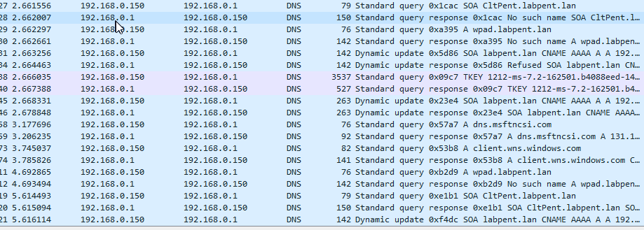

## 6. DNS Spoofing / Protection ?

### DNS Spoofing ou DNS poisoning, consiste à modifier les informations DNS pour rediriger des sites malveillants plutôt les légitimes.

### Pour s'en protéger :

- Utiliser un DNS sécurisé
- Mettre à jour régulièrement les logiciels et OS
- Utiliser un pare-feu et antivirus
- Éviter de cliquer sur des liens suspects
- Utiliser le protocole HTTPS

## 7. DNS Sec / DNS over TLS / HTTPS

### DNS Sec (DNS Security Extensions) : Protocoles qui fournit une authentification et une intégrité des données pour les réponses DNS. DNS Sec utilise des signatures cryptographiques pour s'assurer que les réponses DNS proviennent de la source prévue et n'ont pas été modifiées en cours de route.

### DNS over TLS (Transport Layer Security) : Protocole qui chiffre les requêtes et les réponses DNS entre un client et un serveur DNS. DNS over TLS utilise le protocole TLS pour établir une connexion sécurisée et chiffrée entre le client et le serveur, ce qui empêche les tiers de voir les requêtes et les réponses DNS.

### DNS over HTTPS (Hypertext Transfer Protocol Secure) : Protocole qui chiffre également les requêtes et les réponses DNS entre un client et un serveur DNS, mais il utilise le protocole HTTPS au lieu de TLS. DNS over HTTPS encapsule les requêtes et les réponses DNS dans des messages HTTPS, ce qui permet de contourner les pare-feu et les systèmes de filtrage qui bloquent les connexions TLS.

## 8. DNS sur TCP

### Requêtes de zone de transfert (AXFR/IXFR): Les serveurs DNS utilisent TCP pour les transferts de zone de transfert, qui impliquent de copier une base de données DNS complète d'un serveur à un autre.

### Réponses tronquées: Si une réponse DNS est trop grande pour tenir dans un seul paquet UDP (généralement limité à 512 octets), le serveur DNS peut renvoyer une réponse tronquée au client. Le client peut alors réémettre sa requête en utilisant TCP pour recevoir la réponse complète.

### DNSSEC (DNS Security Extensions): Bien que DNSSEC puisse fonctionner sur UDP, il peut parfois entraîner des réponses plus volumineuses, ce qui peut nécessiter l'utilisation de TCP en cas de troncature.

### Tunneling DNS: Dans certains réseaux, le DNS peut être tunnellé sur TCP pour contourner les pare-feux ou d'autres restrictions de réseau.

### Requêtes DNS longues: Certaines requêtes DNS, comme celles qui utilisent le type d'enregistrement ANY, peuvent renvoyer beaucoup de données et peuvent donc nécessiter l'utilisation de TCP.

## 9. Capture flux HTTP

    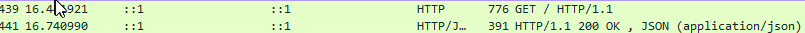

 

## 10. HTTP Smuggling / CVE

### HTTP Smuggling : Technique d'attaque qui exploite les ambiguïtés dans la façon dont les requêtes et les réponses HTTP sont interprétées par les serveurs web, les proxies et autres composants de l'infrastructure réseau. Cette attaque permet de se faire passer en contrebande des données HTTP malveillantes ou de perturber le traitement des requêtes HTTP légitimes.

### Exemple CVE-2020-11984 : Vulnérabilité de type HTTP Smuggling dans le serveur web Apache Traffic Server (ATS). Permet à un attaquant distant d'injecter des données malveillantes dans le flux de trafic HTTP ou de provoquer un déni de service (DoS) en faisant échouer le traitement des requêtes HTTP légitimes. La vulnérabilité a été corrigée dans la version 7.1.12 d'Apache Traffic Server.

## 11. Confidentialité et l'authenticité HTTP

### Utiliser HTTPS (Hypertext Transfer Protocol Secure) à la place de HTTP (Hypertext Transfer Protocol). HTTPS est une extension de HTTP qui ajoute une couche de sécurité supplémentaire en utilisant des protocoles de cryptographie tels que SSL (Secure Sockets Layer) ou TLS (Transport Layer Security).

- Obtenir un certificat SSL/TLS auprès d'une autorité de certification (CA) de confiance. Il existe également des CA gratuites comme Let's Encrypt.
- Installez le certificat SSL/TLS sur votre serveur web.
- Configurer votre serveur web pour utiliser HTTPS au lieu de HTTP. Cela implique généralement de rediriger tout le trafic HTTP vers HTTPS et de s'assurer que tous les liens internes du site utilisent HTTPS.
- Testez votre configuration HTTPS avec un outil de test SSL/TLS pour vous assurer que votre configuration HTTPS est sécurisée et que votre certificat SSL/TLS est valide.

## 12. PKI

### La PKI est utilisée pour fournir une sécurité renforcée pour les communications réseau, les transactions financières, l'échange de données sensibles et d'autres activités où la sécurité et l'authentification sont essentielles. Elle fonctionne en utilisant des paires de clés cryptographiques - une clé publique et une clé privée. La clé publique est largement diffusée et utilisée pour chiffrer les données, tandis que la clé privée est gardée secrète et utilisée pour déchiffrer les données.

## 13. Capture un mot de passe FTP

    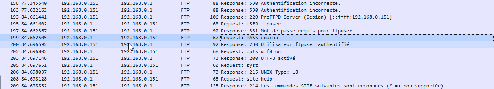

 

## 14. Confidentialité FTP

### Utiliser une méthode de chiffrement pour protéger les données en transit (FTPS (FTP sur SSL/TLS) ou SFTP (FTP sur SSH))

## 15. Capture handshake TLS

    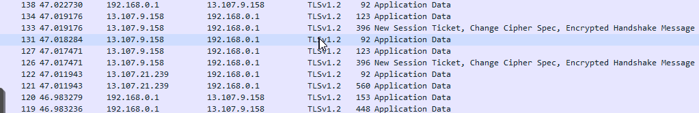

## 16. Déchiffrer le trafic TLS avec votre certificat et/ou votre clé de session

    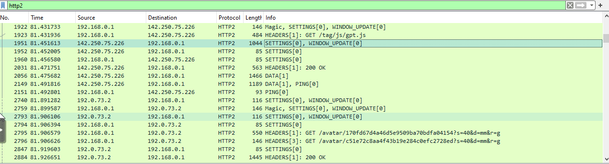

## 17. Autorité de certification (AC) racine / intermediaire

### Une autorité de certification (AC) est un organisme de confiance qui délivre des certificats numériques attestant l'identité d'une entité (ex. un site web, une personne, une organisation) et permettant d'établir des communications sécurisées.

### Une AC racine est auto-signée, elle a émis son propre certificat. C'est le point de confiance ultime dans la chaîne de certification. Ils sont généralement préinstallés dans les systèmes d'exploitation et les navigateurs web.

### Une AC intermédiaire est délivrée par une AC racine ou une autre AC intermédiaire. C'est un intermédiaire de confiance entre l'AC racine et les entités auxquelles elle délivre des certificats. Elles permettent de répartir la charge de travail de délivrance de certificats et de limiter l'exposition de la clé privée de l'AC racine.

## 18. Chaine de confiance du certificat https://taisen.fr

    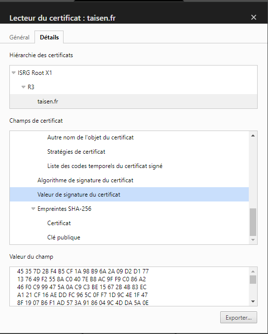

## 19. Capture une authentification Kerberos (mettre en place le service si nécessaire)

    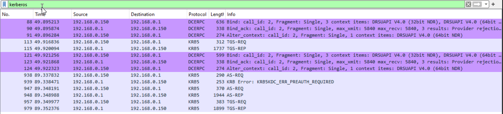

## 20. Capturer une authentification RDP (mettre en place le service si nécessaire)

    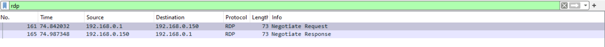

## 21. Attaques connues sur NetLM

### Attaques par force brute : En raison de la faible complexité des hachages LM, il est relativement facile de les casser en utilisant des attaques par force brute. Les hachages LM sont créés en divisant le mot de passe en deux parties de 7 caractères chacune, ce qui rend le processus de cassage plus rapide.

### Attaques par dictionnaire : Les attaques par dictionnaire sont également efficaces contre les hachages LM. Dans ce type d'attaque, un attaquant utilise un fichier de mots de passe couramment utilisés (appelé dictionnaire) pour essayer de trouver le mot de passe correspondant au hachage.

### Attaques de downgrade : Dans une attaque de downgrade, un attaquant force un système à utiliser un protocole d'authentification plus ancien et moins sécurisé, comme NetLM au lieu de NTLM. Cela peut être fait en envoyant des paquets de réponse spécialement conçus à un système cible.

### Attaques de récupération de mot de passe : Dans les versions de Windows qui utilisent NetLM, les mots de passe sont stockés localement dans un fichier appelé SAM (Security Account Manager). Si un attaquant peut accéder à ce fichier, il peut utiliser des outils spéciaux pour extraire les mots de passe.

### Attaques de rejeu : Dans une attaque de rejeu, un attaquant intercepte des données d'authentification valides (comme un hachage NetLM) et les utilise ensuite pour se faire passer pour un utilisateur légitime. Ce type d'attaque peut être particulièrement efficace sur les réseaux non chiffrés.

## 22. Capturer une authentification WinRM (Vous pouvez utiliser EvilWinRM si nécessaire côté client.)

    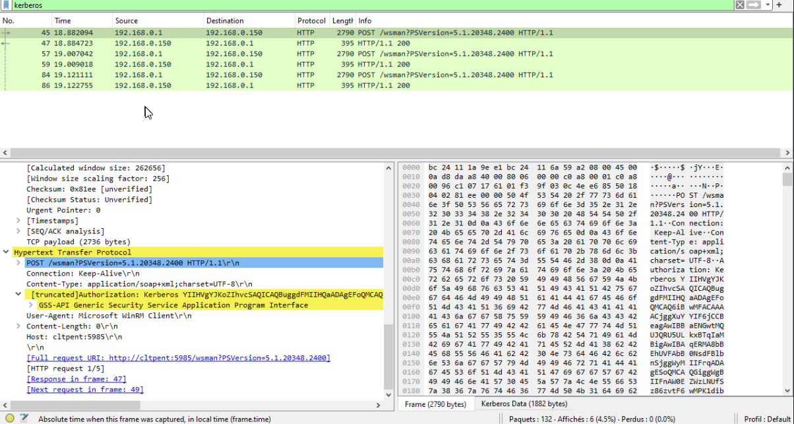

## 23. Capturer une authentification SSH ou SFTP (mettre en place le service si nécessaire)

    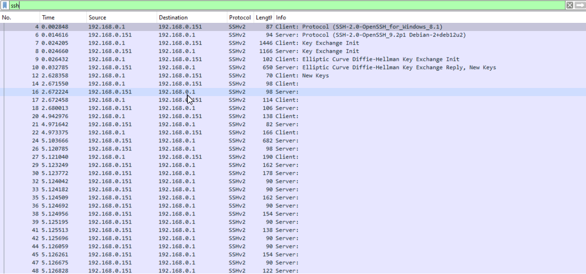

## 24. Intercepter un fichier au travers du protocole SMB

    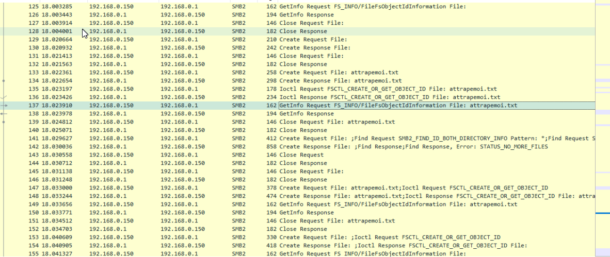

## 25. Comment proteger l'authenticité et la confidentialité d'un partage SMB ?

- Utilisez des mots de passe forts
- Activez le chiffrement
- Utilisez la signature SMB
- Limitez l'accès au partage SMB
- Mettez à jour vos systèmes
- Utilisez un VPN

## B1. Déchiffrer le traffic TLS en important la clé privée du certificat dans Wireshark

## B2. Reconstituer un fichier qui à transité sur le réseau à l'aide de Wireshark
