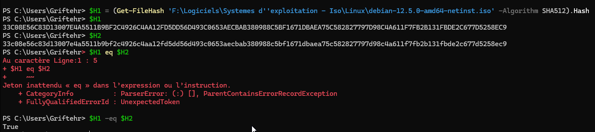
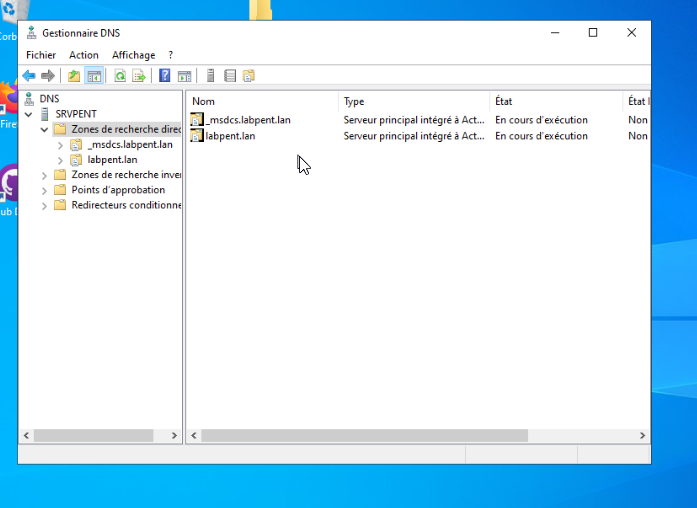
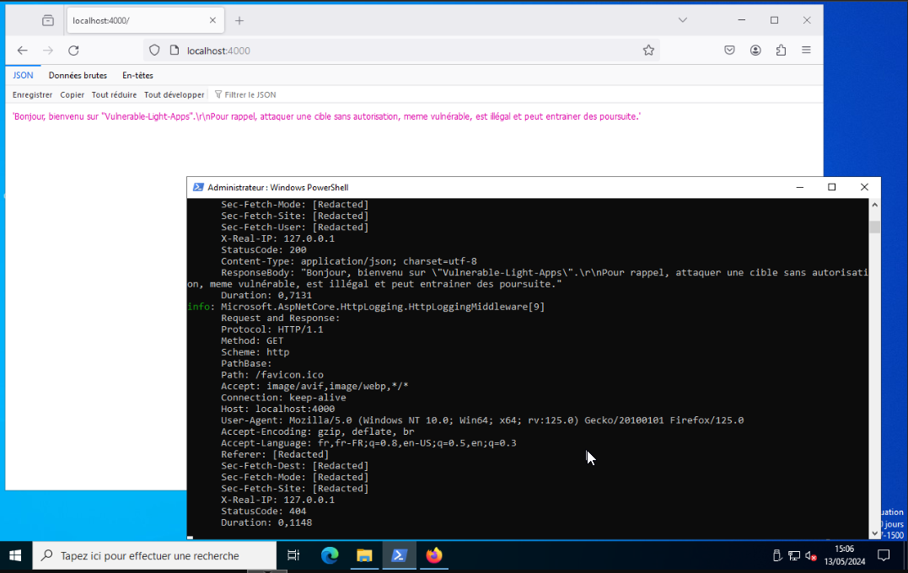
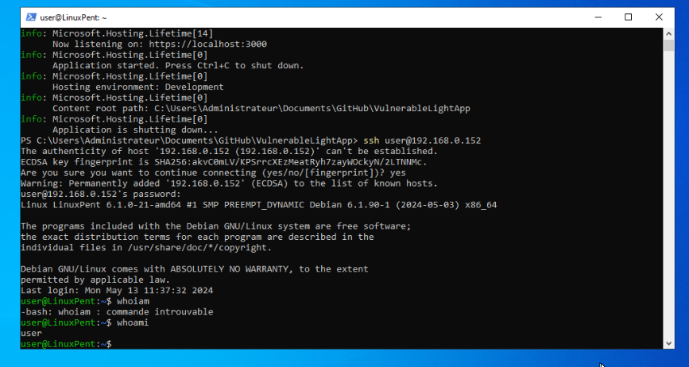
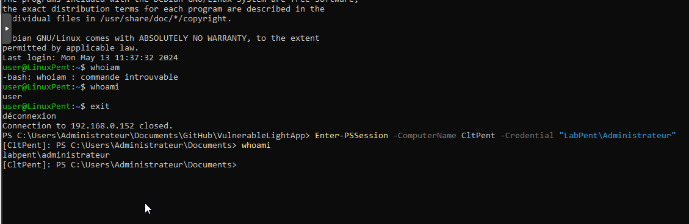
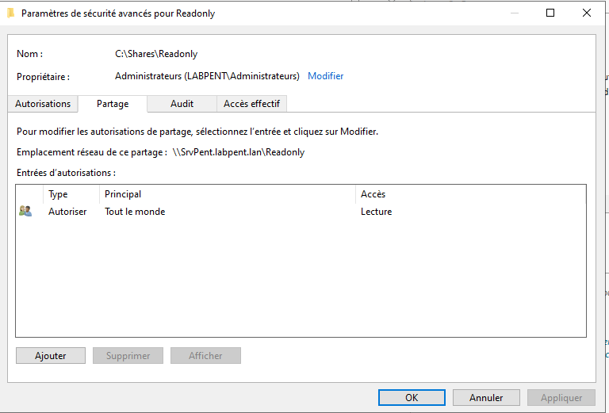
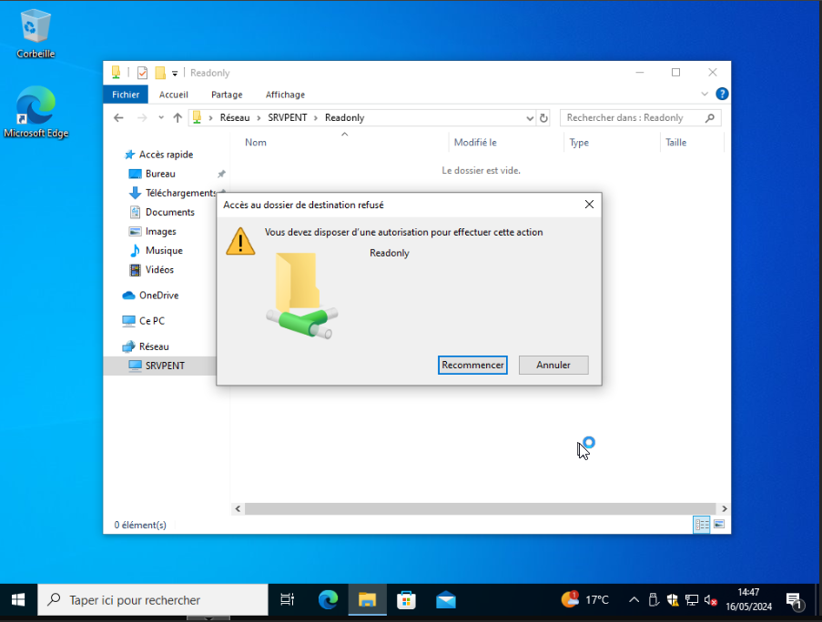
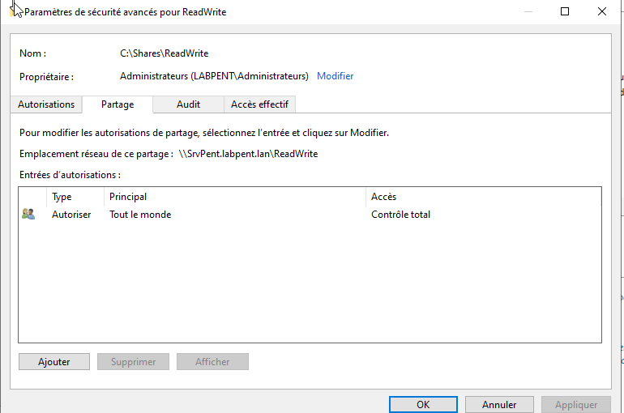
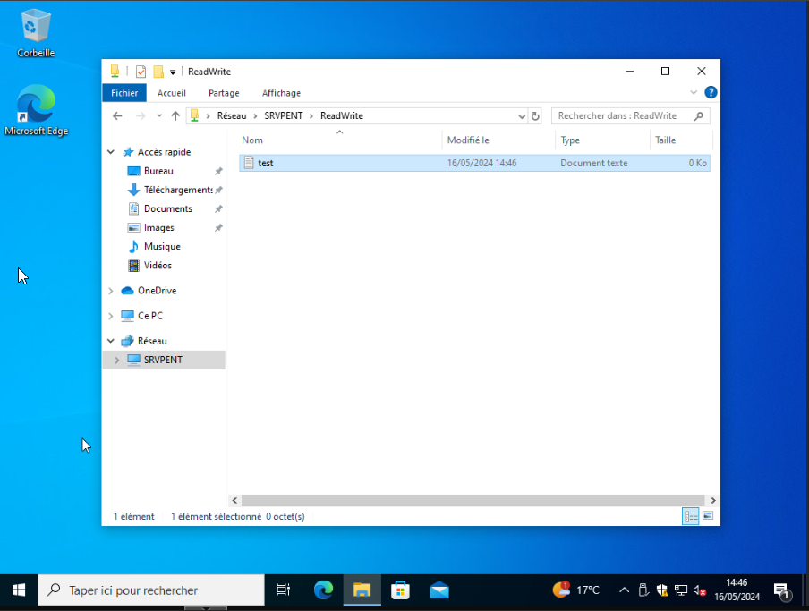
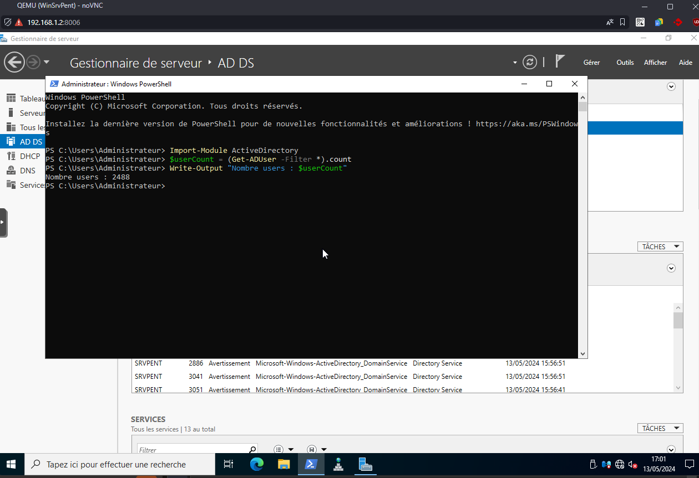

# Rendu Capture Ecran Install LAB

## Verification Hash Iso Debian

    

## Status DNS et WEB

    

    

## Connexions SSH et WinRM

    

    

## Permissions et statut du partage SMB

    

    

    

    

## Nombre d'utilisateurs contenus dans l'AD

    

