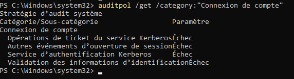
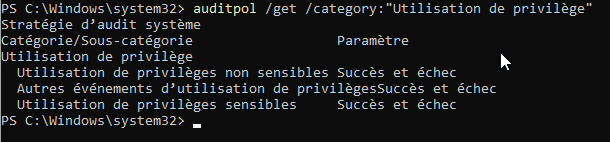
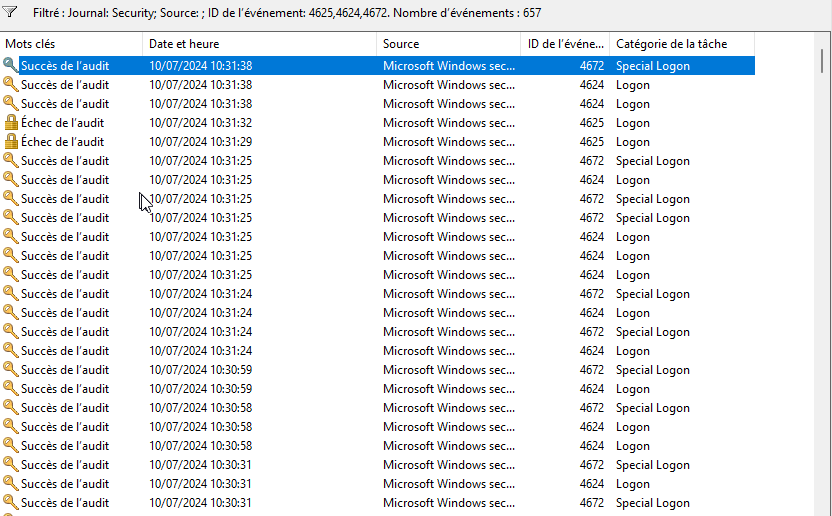
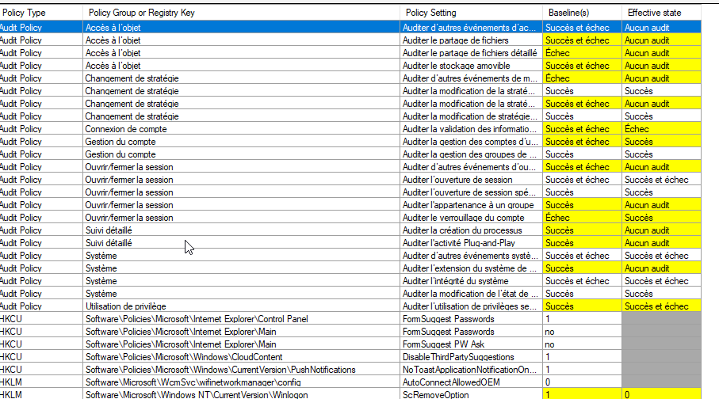
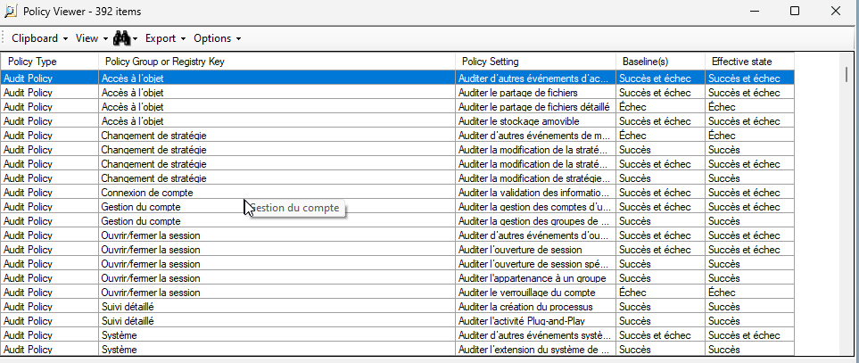
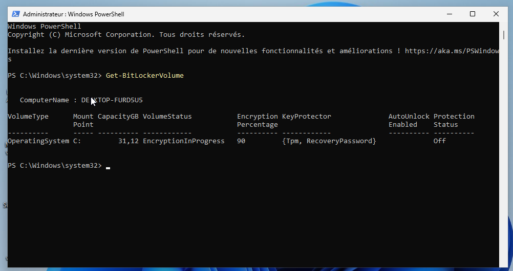

# Utilisation Auditpol

AuditPol [/commande] [/souscommande]
## Verification des politiques

AuditPol /get /category:*

## Configuration pour erreur d'authentification

Auditpol /set /category:"Connexion de compte" /failure:enable

Auditpol /set /subcategory:"Ouvrir la session" /failure:enable

    

## Configuration pour Audit escalade de privilèges

Auditpol /set /category:"Utilisation de privilège" /success:enable /failure:enable

    

## Capture d'événements

    

# MSCT et LGPO doc 

https://learn.microsoft.com/fr-fr/windows/security/operating-system-security/device-management/windows-security-configuration-framework/security-compliance-toolkit-10

## Policy Analyser 

### Avant script MSCT

    

### Apres script

    

# Activation Bitlocker

    

# Renforcer config Antivirus powershell

coucou

