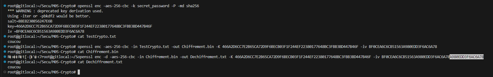
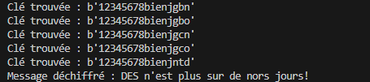

# Les différents algorithmes

## Algo recommandés

**AES 256 avec mécanisme XTS** : chiffrement symétrique très sécurisé

**SHA2** : fonction de hachage sécurisée 

**RSA avec OAEP** : C'est un schéma de chiffrement à clé publique sécurisé

## Algo non recommandés

**AES 128 avec ECB** : ECB (Electronic Codebook) chiffre chaque bloc de manière identique, ce qui peut révéler des modèles dans les données

**3DES** : lenteur et faible sécurité

**SHA1** : encore largement utilisé, faible et obsolète en raison de vulnérabilités connues.

**MD5** : obsolète et non sécurisé en raison de vulnérabilités connues

**RSA avec PKCS1**mais no : encore largement utilisé, il a des vulnérabilités connues passer à OAEP est recommandé

# Chiffrer un message

## Generer clé AES256 et IV
openssl enc -aes-256-cbc -k secret_password -P -md sha256

## Crypter un message
openssl enc -aes-256-cbc -in TestCrypto.txt -out Chiffrement.bin -K XXXXXXXXXXXXXXKEYXXXXXXXX -iv XXXXXXXXXIVXXXXXXX

## Décrypter le message 

openssl enc -d -aes-256-cbc -in Chiffrement.bin -out Dechiffrement.txt -K XXXXXXXXXXXXXXKEYXXXXXXXX -iv XXXXXXXXXIVXXXXXXX

    

### Exemple de script pour chiffrer
https://github.com/sipb64/Secu/blob/main/M05-Crypto/ChiffrerMess.sh

### Exemple de script pour déchiffrer
https://github.com/sipb64/Secu/blob/main/M05-Crypto/DechiffrerMess.sh

# Générer une clé de chiffrement sûre et risque IV identiques

- Utiliser un générateur de nombres aléatoires cryptographiquement sécurisé
- Choisir la bonne taille de clé (elle dépend de l'algorithme utilisé)
- Protéger la clé et la stocker en toute sécurité (ex. TPM, HSM)

Les vecteurs d'initialisation (IV) s'assurent que le même texte en clair ne se traduit pas par le même texte chiffré lorsqu'il est chiffré plusieurs fois. Si les IV sont toujours les mêmes, des attaques par texte chiffré choisi ou texte en clair choisi, compromettent la sécurité du chiffrement.

# Message vulnérable 

Message intercepté : (il semble vulnérable à une attaque en fréquences ou une attaque par force brute)

"prggr grpuavdhr f'nccryyr yr puvsserzrag qr prnfre, vy a'rfg cyhf hgvyvft nhwbheq'uhv, pne crh ftphevft"

Code César

https://www.dcode.fr/chiffre-cesar 

Message déchiffré :

"cette technique s'appelle le chiffrement de ceaser, il n'est plus utilisg aujourd'hui, car peu sgcurisg" (probleme de décalage dans des dernier e ?)

# Problème AES-CBS

* Bob: '>s\x06\x14\x0c\xa7\xa6\x88\xd5[+i\xcc/J\xf7'
* Alice: "3\x01\xeb\xcah\xf6\x1f\xc2[\xf9}P'A\xe0\xd5"
* Bob: '\xf7\xb0\xc5\xccO\xab&\xee\xa4&6N?V\xbd\x85\x94b\xee\xc5\x18\x1f9\xe7\xe5\xe0\xffyf\xab\xfb\xb9
* Alice: '\xde@=\x1ed\xc0Qe\x0fK=\x1c\xb3$\xd9\xcb'
* Bob: '\xce\xbf\x0e\\\x8aX\x1c \xb2v\x97\xf5<\x86M\x86\x0c\xa1j\xa0\xe6\xa9\x11\xf9AyZ\xda9\x94ec'
* Alice: "\xde@=\x1ed\xc0Qe\x0fK=\x1c\xb3$\xd9\xcb"
* Bob: '\xfb\x0cc\xb0/\xd4:\xde\xe7a\x95_L\x8d\x108\xac\xff\xcep\x8e&\xcfq6ym\x0c\xf6\xccI\xed'
* Alice: '\xee\xcb\xd0\x9aRt;\x12\xca\xfe\r\x01MN>\xde'
* Bob: '\xab\x8aX\xef\xd4\xf3\x88a\x1a\x96\r\xec\x17\xe6s"\x94\xec6\xe0\xff \x82\xa1\xb4\xe2\xc1\x08\r!T\x89\xe2B\x1d^\xf7l\xd8\xc9\xa4\xcd\xa5\x8e\xb3\x1d\x1f\xe7'
* Alice: '\xee\xcb\xd0\x9aRt;\x12\xca\xfe\r\x01MN>\xde'
* Alice: '\x1f\xafV4\xcb\x116N\xc5.\xa8\xdfM\xcf\xda\x02\x98\xbb\x04\x04C}N{\xf95\x05e\xc6\xf9\xbe,'
* Bob: '\xde@=\x1ed\xc0Qe\x0fK=\x1c\xb3$\xd9\xcb'

## Analyse du log

Réponses répétées avec le même message chiffré :

Alice :
* \xde@=\x1ed\xc0Qe\x0fK=\x1c\xb3$\xd9\xcb
* \xee\xcb\xd0\x9aRt;\x12\xca\xfe\r\x01MN>\xde

Bob :
* \xde@=\x1ed\xc0Qe\x0fK=\x1c\xb3$\xd9\xcb

La réutilisation de l'IV dans AES-CBC peut permettre à un attaquant d'effectuer des attaques de type chosen-plaintext ou known-plaintext, permettant de déduire certaines informations sur les messages chiffrés, voire de récupérer le texte en clair sous certaines conditions.

## Solution

* S'assurer que chaque message utilise un IV unique.
* Effectuer un audit de sécurité complet pour détecter et corriger toute autre vulnérabilité potentielle.
* Changer de mode de chiffrement (ex. AES-GCM)
* Implémenter un schéma d'authentification des messages (ex. HMAC)

# Message intercepté avec 1ère partie de clé

Message chiffré -> b'\xd72U\xc03.\xda\x99Q\xb5\x020\xc4\xb8\x16\xc6\xfa-\xb9U+\xda\\\x126L\xf3~\xbd8\x12q\x02?\x80\xeaVI\xa9\xe1'

Clé partiel 16 octets -> b'12345678bien'

## Script pour trouver la clé
https://github.com/sipb64/Secu/blob/main/M05-Crypto/AlgoInter.py

## Message déchiffré

    

