# Rapport d'Audit de Sécurité - Référentiel PASSI

## 1. Introduction 
Contexte de l'audit : 

ABC est une entreprise spécialisée dans le développement de logiciels, employant 30 salariés. Dans le cadre de son programme d'audit, ABC a sollicité nos services pour réaliser un audit de sécurité de certains composants de son système d'information (SI). 

Périmètre de l'audit : 

L’audit couvre le serveur Linux non intégré au domaine hébergeant un serveur FTP et un serveur Web. (Vérification de la sécurité et de la configuration du serveur).

## 2. Objectif de l'Audit

L'objectif de cet audit est d'évaluer la sécurité de l'infrastructure et des applications en place, afin d'identifier les vulnérabilités potentielles et de proposer des recommandations pour améliorer la sécurité globale du SI.


## 4. Méthodologie

Cet audit sera réalisé en suivant la méthodologie [PASSI (Prestataire d'Audit de la Sécurité des Systèmes d'Information)](https://cyber.gouv.fr/entreprises/qualifications/passiprestataire-daudit-de-la-securite-des-systemes-dinformation).

Les recommandations seront également basées sur le [guide de sécurité relatif à un système GNU/Linux](https://cyber.gouv.fr/publications/recommandations-de-securite-relatives-un-systeme-gnulinux) publié par l'ANSSI.

Cette approche structurée nous permettra d'effectuer une évaluation complète et rigoureuse des composants du SI d'ABC.
Les étapes principales de la méthodologie PASSI incluent l'analyse des risques, les tests techniques, les entretiens avec le personnel et l'observation sur le terrain.

## 5. Résumé Exécutif

Ce résumé présente les principaux constats de l'audit, les vulnérabilités critiques identifiées, et les recommandations clés.

### 5.1 Constat Global


| Critère                                      | Détails                                                             |
|----------------------------------------------|---------------------------------------------------------------------|
| **État général**                            | Critique                                                            |
| **Nombre de vulnérabilités identifiées**     | 12                                                                  |
| **Vulnérabilités critiques**                | 6                                                                   |
| **Risques majeurs identifiés**              | - Compromission par force brute (Fail2Ban non installé)              |
|                                              | - Saturation des journaux systèmes (Absence de partitionnement /var) |
|                                              | - Exposition à des attaques physiques ou des fuites de données par USB (USBGuard non installé) |
|                                              | - Compromission de la robustesse des mots de passe (Durée maximale de validité du mot de passe désactivée) |


---

## 6. Constatations Détaillées
Le serveur à était installé avec les configurations par défaut. 

### 6.1 Vulnérabilités Identifiées

| ID  | Type de vulnérabilité                                    | Niveau de risque | Impact potentiel                                                       | Priorité | Actions possibles d'un attaquant                                      | Référence ANSSI |
|-----|----------------------------------------------------------|------------------|------------------------------------------------------------------------|----------|-----------------------------------------------------------------------|-----------------|
| 01  | Absence de Fail2Ban                                      | Élevé            | Compromission par force brute                                          | Haute    | Lancer des attaques par force brute pour accéder au système           | R19           |
| 02  | Absence de partitionnement /var                          | Moyen            | Saturation des journaux systèmes et des logs                           | Moyenne  | Saturer le système en générant des logs excessifs                     | R28             |
| 03  | Aucun mot de passe GRUB                                  | Élevé            | Modification des paramètres de démarrage par une personne non autorisée | Haute    | Modifier les paramètres de démarrage pour obtenir un accès non autorisé| R5             |
| 04  | Permissions pour le répertoire /etc/sudoers.d            | Élevé            | Risque d'escalade de privilèges non autorisée                          | Haute    | Modifier les fichiers pour obtenir des privilèges administratifs      | R39             |
| 05  | Permissions pour le fichier de configuration CUPS        | Moyen            | Risque de sécurité lié aux permissions des fichiers                    | Moyenne  | Accéder ou modifier les configurations d'impression                    | R63             |
| 06  | wpa_supplicant.service                                   | Risqué           | Vulnérabilités potentielles dans la gestion des connexions Wi-Fi       | Haute    | Exploiter les vulnérabilités pour intercepter ou manipuler les connexions Wi-Fi |              |
| 07  | user@1000.service                                        | Risqué           | Risque potentiel lié à des services utilisateurs mal configurés         | Haute    | Exploiter les services mal configurés pour obtenir un accès non autorisé | R67             |
| 08  | systemd-rfkill.service                                   | Risqué           | Risque lié à la gestion des périphériques RF (Wi-Fi/Bluetooth)         | Haute    | Manipuler les périphériques RF pour intercepter ou perturber les communications |              |
| 09  | USBGuard non installé                                    | Élevé            | Exposition du système à des attaques physiques ou à des fuites de données par USB | Haute    | Utiliser des périphériques USB pour injecter des malwares ou voler des données |              |
| 10  | Paramètres de timeout de session                         | Moyen            | Risque d'accès non autorisé en cas de session inactive                 | Moyenne  | Accéder au système si une session reste ouverte et inactive           | R32             |
| 11  | Pas de scanner de malware                                | Élevé            | Système vulnérable aux menaces                                         | Haute    | Introduire des malwares sans être détecté                             |              |
| 12  | Durée maximale de validité du mot de passe désactivée    | Très élevé       | Compromission de la robustesse des mots de passe sur le long terme     | Très haute | Exploiter des mots de passe faibles ou anciens pour accéder au système | R31             |
| 13  | Ports ouverts non sécurisés                              | Haut             | Compromission du serveur via un service non sécurisé                   | Haute    | Lancer des attaques via des ports ouverts non sécurisés (ex : 80, 23) | R12             |
| 14  | NetworkManager.service                           | Élevé            | Compromission de la gestion des connexions réseau                      | Haute    | Exploiter la vulnérabilité pour perturber ou intercepter les connexions réseau | R78             |
| 15  | ssh.service                                              | Élevé            | Accès non autorisé au système                                          | Haute    | Exploiter la vulnérabilité pour obtenir un accès non autorisé au système | R33             |
 
## 7. Recommandations

### 7.1 Recommandations Générales

Quelques ajustements sont nécessaires pour optimiser la sécurité du serveur.

| Vulnérabilité | Action recommandée | Priorité |
|---------------|--------------------|----------|
| 01 | Installez Fail2Ban pour bannir automatiquement les hôtes ayant plusieurs erreurs d'authentification. | Haute |
| 02 | Partitionner le disque en séparant /home /tmp /var | Moyenne |
| 03 | Affecter un mot de passe robuste au GRUB | Haute |
| 04 | Vérifiez et ajustez les permissions du répertoire /etc/sudoers.d pour éviter les escalades de privilèges non autorisées. | Haute |
| 05 | Vérifiez et ajustez les permissions des fichiers de configuration de CUPS pour améliorer la sécurité. | Moyenne |
| 06 | Examinez la configuration du service wpa_supplicant pour identifier et corriger les vulnérabilités potentielles. | Haute |
| 07 | Vérifiez la configuration du service user@1000 pour garantir qu'il ne présente pas de risques de sécurité. | Haute |
| 08 | Examinez la configuration du service systemd-rfkill pour réduire les risques liés à la gestion des périphériques RF. | Haute |
| 09 | Installer et configurer USBGuard | Haute |  
| 10 | Configurer le timeout des sessions utilisateur local et SSH | Moyenne |
| 11 | Installer ClamAV et planifier des scans automatiques | Haute |
| 12 | Configurer la durée maximale de validité des mots de passe de minimum 90 jours | Très haute |
| 13 | Fermer les ports non utilisés et sécuriser les services sur les ports ouverts | Haute |
| 14 | Mettez à jour NetworkManager et configurez-le correctement pour limiter les risques de sécurité | Haute |
| 15 | Mettez à jour OpenSSH et configurez-le correctement pour limiter les risques de sécurité | Haute |


| ... | ... | ... | ... |

---

## Conclusion

L’audit a révélé 15 vulnérabilités dans le système, dont 7 sont considérées comme critiques. Ces vulnérabilités exposent le système à divers risques de sécurité, allant des attaques par force brute à l’exposition aux menaces physiques. Les principales préoccupations identifiées incluent l’absence de mesures de sécurité essentielles comme Fail2Ban et USBGuard, ainsi que des configurations inappropriées pour les services et les permissions des fichiers.

Les recommandations proposées visent à remédier aux problèmes identifiés et à renforcer la sécurité globale du système. Les actions recommandées comprennent l’installation et la configuration appropriée de Fail2Ban, l’activation de USBGuard, et l’ajustement des paramètres de sécurité pour divers services et fichiers système.

Il est crucial que ces recommandations soient mises en œuvre rapidement pour réduire les risques et protéger le système contre les menaces potentielles. Un suivi régulier et une réévaluation périodique des mesures de sécurité sont également recommandés pour garantir que le système reste sécurisé contre les vulnérabilités émergentes.

L’amélioration des mesures de sécurité est essentielle pour assurer l’intégrité, la confidentialité et la disponibilité des données et des services.

---

## 9. Annexes

### 9.1 Glossaire

- **PASSI** : Prestataire d'Audit de la Sécurité des Systèmes d'Information
- **Vulnérabilité** : Faiblesse d'un système ou d'une infrastructure qui peut être exploitée pour compromettre sa sécurité.

- **Fail2Ban** : Outil de sécurité qui bannit automatiquement les adresses IP après plusieurs tentatives d'authentification échouées, réduisant ainsi le risque d'attaques par force brute.

- **Partitionnement** :
  - **/home** : Répertoire contenant les fichiers personnels des utilisateurs. La création d'une partition distincte pour /home isole ces données pour une meilleure gestion et sécurité.
  - **/tmp** : Répertoire utilisé pour les fichiers temporaires. Une partition séparée aide à prévenir la saturation des ressources.
  - **/var** : Répertoire où sont stockés les journaux systèmes et autres fichiers variables. Une partition dédiée permet d'éviter la saturation des logs et améliore la gestion des espaces.

- **GRUB (Grand Unified Bootloader)** : Programme de démarrage utilisé pour gérer les systèmes d'exploitation installés. L'absence d'un mot de passe GRUB expose le système à des modifications non autorisées des paramètres de démarrage.

- **/etc/sudoers.d** : Répertoire contenant des fichiers de configuration pour les privilèges sudo. Des permissions incorrectes peuvent permettre des escalades de privilèges non autorisées.

- **CUPS (Common UNIX Printing System)** : Système d'impression utilisé sur les systèmes UNIX. Les permissions des fichiers de configuration CUPS doivent être correctement définies pour éviter les risques de sécurité.

- **wpa_supplicant.service** : Service utilisé pour gérer les connexions Wi-Fi. Des vulnérabilités dans ce service peuvent compromettre la sécurité des connexions sans fil.

- **user@1000.service** : Service lié aux sessions utilisateurs. Une configuration incorrecte peut présenter des risques de sécurité liés aux services mal configurés.

- **systemd-rfkill.service** : Service utilisé pour gérer les périphériques RF (Wi-Fi/Bluetooth). Des configurations incorrectes peuvent exposer à des risques de sécurité.

- **USBGuard** : Outil de sécurité pour contrôler les périphériques USB connectés au système. Son absence expose le système à des attaques physiques ou des fuites de données via USB.

- **Timeout de session** : Paramètre de sécurité qui déconnecte automatiquement une session inactive. Des paramètres de timeout insuffisants augmentent le risque d'accès non autorisé.

- **Scanner de malware** : Logiciel destiné à détecter et éliminer les logiciels malveillants. L'absence de scanner de malware laisse le système vulnérable aux menaces.

- **Durée maximale de validité du mot de passe** : Paramètre de sécurité qui définit la période pendant laquelle un mot de passe reste valide avant d'exiger un changement. Une durée maximale désactivée compromet la robustesse des mots de passe sur le long terme.


### 9.3 Logs et Résultats des Tests Techniques

## Vulnerabilité ID : 01 


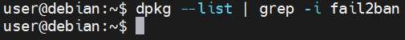
| **Faille**                | **Niveau de Sévérité** | **Risque**                       | **Impact**                                                                                   | **Solution**                                                                                     |
|---------------------------|------------------------|----------------------------------|----------------------------------------------------------------------------------------------|--------------------------------------------------------------------------------------------------|
| Absence de Fail2Ban       | Élevé                  | Compromission par force brute   | Compromission complète du serveur, accès à des informations sensibles ou prise de contrôle   | Installer et configurer Fail2Ban pour analyser les logs et bloquer les adresses IP suspectes     |

### Résolution de la Faille

1. **Installation de Fail2Ban** :
   - Sur une distribution basée sur Debian, utilisez la commande suivante :
     ```bash
     sudo apt-get install fail2ban
     ```

2. **Configuration de Fail2Ban** :
   - Copiez les fichiers de configuration par défaut pour éviter qu'ils ne soient écrasés lors des mises à jour :
     ```bash
     sudo cp /etc/fail2ban/jail.conf /etc/fail2ban/jail.local
     ```
   - Éditez le fichier `jail.local` pour configurer les paramètres de base :
     ```bash
     sudo nano /etc/fail2ban/jail.local
     ```
   - Ajoutez ou modifiez les lignes suivantes pour configurer les paramètres de base :
     ```bash
     [DEFAULT]
     ignoreip = 127.0.0.1/8
     bantime  = 600
     findtime  = 600
     maxretry = 3
     ```

3. **Activation des Jails** :
   - Activez les jails pour les services que vous souhaitez protéger, par exemple pour SSH :
     ```bash
     [sshd]
     enabled = true
     port    = ssh
     filter  = sshd
     logpath = /var/log/auth.log
     maxretry = 3
     ```

4. **Redémarrage de Fail2Ban** :
   - Après avoir configuré les jails, redémarrez le service Fail2Ban pour appliquer les changements :
     ```bash
     sudo systemctl restart fail2ban
     ```

5. **Vérification du Statut** :
   - Vérifiez le statut des jails actifs pour vous assurer que tout fonctionne correctement :
     ```bash
     sudo fail2ban-client status
     ```

## Vulnerabilité ID : 02
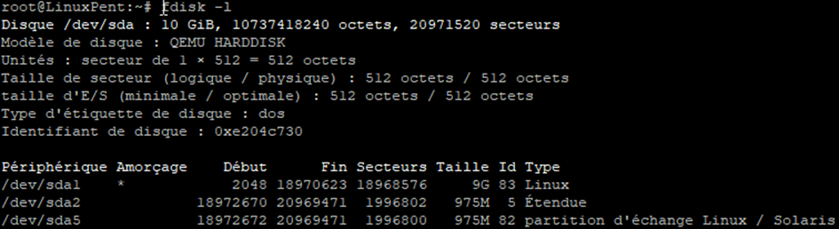

| **Faille**                        | **Niveau de Sévérité** | **Risque**                               | **Impact**                                                                                   | **Solution**                                                                                     |
|-----------------------------------|------------------------|------------------------------------------|----------------------------------------------------------------------------------------------|--------------------------------------------------------------------------------------------------|
| Absence de partitionnement /var   | Moyen                  | Saturation des journaux systèmes et des logs | Saturation du disque, ce qui peut entraîner des pannes du système et des pertes de données   | Partitionner le répertoire /var pour isoler les journaux et les logs des autres données du système |

### Vérification de la Faille

1. **Vérification de l'absence de partitionnement** :
   - Utilisez la commande `df` pour vérifier si `/var` est une partition distincte :
     ```bash
     df -h | grep /var
     ```
   - Si `/var` n'apparaît pas comme une partition distincte, cela signifie qu'elle n'est pas partitionnée.

### Résolution de la Faille

1. **Sauvegarde des Données** :
   - Avant de commencer, il est important de sauvegarder toutes les données importantes.

2. **Création d'une Nouvelle Partition** :
   - Utilisez `fdisk` ou `parted` pour créer une nouvelle partition. Par exemple, avec `fdisk` :
     ```bash
     sudo fdisk /dev/sdX
     ```
   - Suivez les instructions pour créer une nouvelle partition.

3. **Formatage de la Nouvelle Partition** :
   - Formatez la nouvelle partition avec un système de fichiers approprié, comme ext4 :
     ```bash
     sudo mkfs.ext4 /dev/sdX1
     ```

4. **Montage de la Nouvelle Partition** :
   - Créez un point de montage pour la nouvelle partition :
     ```bash
     sudo mkdir /mnt/newvar
     ```
   - Montez la nouvelle partition :
     ```bash
     sudo mount /dev/sdX1 /mnt/newvar
     ```

5. **Copie des Données** :
   - Copiez les données existantes de `/var` vers la nouvelle partition :
     ```bash
     sudo rsync -av /var/ /mnt/newvar
     ```

6. **Modification de `fstab`** :
   - Ajoutez une entrée dans `/etc/fstab` pour monter automatiquement la nouvelle partition au démarrage :
     ```bash
     /dev/sdX1   /var   ext4   defaults   0   2
     ```

7. **Redémarrage du Système** :
   - Redémarrez le système pour appliquer les changements :
     ```bash
     sudo reboot
     ```

8. **Vérification** :
   - Après le redémarrage, vérifiez que la nouvelle partition est correctement montée :
     ```bash
     df -h
     ```


## Vulnerabilité ID : 03
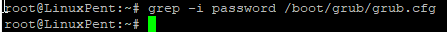

| **Faille**                | **Niveau de Sévérité** | **Risque**                                               | **Impact**                                                                                   | **Solution**                                                                                     |
|---------------------------|------------------------|----------------------------------------------------------|----------------------------------------------------------------------------------------------|--------------------------------------------------------------------------------------------------|
| Aucun mot de passe GRUB   | Élevé                  | Modification des paramètres de démarrage par une personne non autorisée | Compromission du système, accès non autorisé aux paramètres de démarrage                     | Configurer un mot de passe pour GRUB pour protéger l'accès aux paramètres de démarrage            |

### Vérification de la Faille

1. **Vérification de l'absence de mot de passe GRUB** :
   - Utilisez la commande suivante pour vérifier si un mot de passe est configuré dans GRUB :
     ```bash
     sudo grep -i password /boot/grub/grub.cfg
     ```
   - Si aucune ligne contenant `password` n'est trouvée, cela signifie qu'aucun mot de passe n'est configuré.

### Résolution de la Faille

1. **Génération d'un Mot de Passe Hashé** :
   - Utilisez la commande suivante pour générer un mot de passe hashé :
     ```bash
     sudo grub-mkpasswd-pbkdf2
     ```
   - Entrez le mot de passe souhaité et notez le hash généré.

2. **Modification du Fichier de Configuration de GRUB** :
   - Éditez le fichier `/etc/grub.d/40_custom` pour ajouter le mot de passe :
     ```bash
     sudo nano /etc/grub.d/40_custom
     ```
   - Ajoutez les lignes suivantes en remplaçant `your_hashed_password` par le hash généré :
     ```bash
     set superusers="root"
     password_pbkdf2 root your_hashed_password
     ```

3. **Mise à Jour de la Configuration de GRUB** :
   - Mettez à jour la configuration de GRUB pour appliquer les changements :
     ```bash
     sudo update-grub
     ```

4. **Vérification** :
   - Redémarrez le système et vérifiez que GRUB demande un mot de passe pour accéder aux paramètres de démarrage.

Si vous avez besoin d'aide supplémentaire, n'hésitez pas à demander !

## Vulnerabilité ID : 04

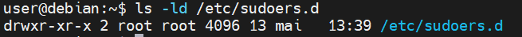

| **Faille**                                | **Niveau de Sévérité** | **Risque**                                               | **Impact**                                                                                   | **Solution**                                                                                     |
|-------------------------------------------|------------------------|----------------------------------------------------------|----------------------------------------------------------------------------------------------|--------------------------------------------------------------------------------------------------|
| Permissions pour le répertoire /etc/sudoers.d | Élevé                  | Risque d'escalade de privilèges non autorisée            | Compromission du système, accès non autorisé aux privilèges administratifs                   | Configurer les permissions correctes pour le répertoire /etc/sudoers.d                           |

### Vérification de la Faille

1. **Vérification des permissions du répertoire** :
   - Utilisez la commande suivante pour vérifier les permissions du répertoire `/etc/sudoers.d` :
     ```bash
     ls -ld /etc/sudoers.d
     ```
   - Les permissions devraient être `drwx------` (0700). Si ce n'est pas le cas, cela signifie que les permissions ne sont pas correctement configurées.

### Résolution de la Faille

1. **Modification des Permissions** :
   - Utilisez la commande suivante pour définir les permissions correctes pour le répertoire `/etc/sudoers.d` :
     ```bash
     sudo chmod 0700 /etc/sudoers.d
     ```

2. **Vérification des Permissions** :
   - Vérifiez à nouveau les permissions pour vous assurer qu'elles sont correctement configurées :
     ```bash
     ls -ld /etc/sudoers.d
     ```

3. **Vérification des Fichiers à l'intérieur du Répertoire** :
   - Utilisez la commande suivante pour vérifier les permissions des fichiers à l'intérieur du répertoire `/etc/sudoers.d` :
     ```bash
     ls -l /etc/sudoers.d
     ```
   - Les permissions devraient être `-r--r-----` (0440). Si ce n'est pas le cas, utilisez la commande suivante pour les corriger :
     ```bash
     sudo chmod 0440 /etc/sudoers.d/*
     ```


## Vulnerabilité ID : 05
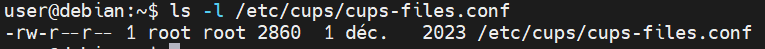
| **Faille**                                | **Niveau de Sévérité** | **Risque**                                               | **Impact**                                                                                   | **Solution**                                                                                     |
|-------------------------------------------|------------------------|----------------------------------------------------------|----------------------------------------------------------------------------------------------|--------------------------------------------------------------------------------------------------|
| Permissions pour le fichier de configuration CUPS | Moyen                  | Risque de sécurité lié aux permissions des fichiers      | Compromission du système, accès non autorisé aux fichiers de configuration                   | Configurer les permissions correctes pour le fichier de configuration CUPS                       |

### Vérification de la Faille

1. **Vérification des permissions du fichier de configuration CUPS** :
   - Utilisez la commande suivante pour vérifier les permissions du fichier `/etc/cups/cups-files.conf` :
     ```bash
     ls -l /etc/cups/cups-files.conf
     ```
   - Les permissions devraient être `-rw-r-----` (0640). Si ce n'est pas le cas, cela signifie que les permissions ne sont pas correctement configurées.

### Résolution de la Faille

1. **Modification des Permissions** :
   - Utilisez la commande suivante pour définir les permissions correctes pour le fichier de configuration CUPS :
     ```bash
     sudo chmod 0640 /etc/cups/cups-files.conf
     ```

2. **Vérification des Permissions** :
   - Vérifiez à nouveau les permissions pour vous assurer qu'elles sont correctement configurées :
     ```bash
     ls -l /etc/cups/cups-files.conf
     ```

## Vulnerabilité ID : 06

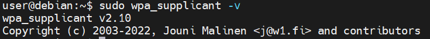
| **Faille**                        | **Niveau de Sévérité** | **Risque**                                               | **Impact**                                                                                   | **Solution**                                                                                     |
|-----------------------------------|------------------------|----------------------------------------------------------|----------------------------------------------------------------------------------------------|--------------------------------------------------------------------------------------------------|
| wpa_supplicant.service            | Élevé                  | Vulnérabilités potentielles dans la gestion des connexions Wi-Fi | Compromission du système, accès non autorisé aux connexions Wi-Fi                            | Mettre à jour wpa_supplicant et restreindre l'accès à l'interface de contrôle                    |

### Vérification de la Faille

1. **Vérification de la version de wpa_supplicant** :
   - Utilisez la commande suivante pour vérifier la version de wpa_supplicant installée :
     ```bash
     wpa_supplicant -v
     ```
   - Si la version est inférieure à 2.10, cela signifie que le système est vulnérable[^1^][6].

### Résolution de la Faille

1. **Mise à Jour de wpa_supplicant** :
   - Mettez à jour wpa_supplicant vers la dernière version disponible. Par exemple, sur une distribution basée sur Debian, utilisez la commande suivante :
     ```bash
     sudo apt-get update
     sudo apt-get install wpasupplicant
     ```

2. **Restreindre l'Accès à l'Interface de Contrôle** :
   - Limitez l'accès à l'interface de contrôle de wpa_supplicant pour réduire la surface d'attaque. Ajoutez ou modifiez les lignes suivantes dans le fichier de configuration de wpa_supplicant (`/etc/wpa_supplicant/wpa_supplicant.conf`) :
     ```bash
     ctrl_interface=DIR=/var/run/wpa_supplicant GROUP=netdev
     update_config=1
     ```

3. **Limiter l'Adhésion au Groupe netdev** :
   - Limitez l'adhésion au groupe `netdev` pour réduire les risques d'exploitation. Utilisez la commande suivante pour vérifier les membres du groupe `netdev` :
     ```bash
     getent group netdev
     ```
   - Retirez les utilisateurs non nécessaires du groupe `netdev` :
     ```bash
     sudo gpasswd -d username netdev
     ```

4. **Redémarrage du Service wpa_supplicant** :
   - Après avoir appliqué les modifications, redémarrez le service wpa_supplicant pour qu'elles prennent effet :
     ```bash
     sudo systemctl restart wpa_supplicant
     ```

## Vulnerabilité ID : 07

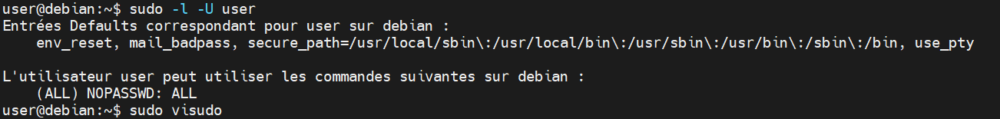

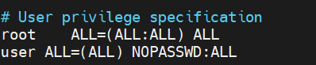


| **Faille**                | **Niveau de Sévérité** | **Risque**                                               | **Impact**                                                                                   | **Solution**                                                                                     |
|---------------------------|------------------------|----------------------------------------------------------|----------------------------------------------------------------------------------------------|--------------------------------------------------------------------------------------------------|
| user@1000.service         | Élevé                  | Risque potentiel lié à des services utilisateurs mal configurés | Compromission du système, accès non autorisé aux services utilisateurs                       | Vérifier et configurer correctement les services utilisateurs pour réduire les risques           |

### Vérification de la Faille

1. **Vérification des services utilisateurs** :
   - Utilisez la commande suivante pour vérifier les services utilisateurs actifs :
     ```bash
     systemctl --user list-units
     ```
   - Recherchez des services non nécessaires ou mal configurés.

### Résolution de la Faille

1. **Désactivation des Services Non Nécessaires** :
   - Désactivez les services utilisateurs non nécessaires pour réduire la surface d'attaque :
     ```bash
     systemctl --user disable nom_du_service
     ```

2. **Vérification et Modification des Permissions** :
   - Vérifiez les permissions des fichiers de configuration des services utilisateurs :
     ```bash
     ls -l ~/.config/systemd/user/
     ```
   - Modifiez les permissions pour restreindre l'accès si nécessaire :
     ```bash
     chmod 0640 ~/.config/systemd/user/nom_du_service.service
     ```

3. **Mise à Jour des Services** :
   - Assurez-vous que tous les services utilisateurs sont à jour pour bénéficier des dernières corrections de sécurité :
     ```bash
     sudo apt-get update
     sudo apt-get upgrade
     ```

4. **Redémarrage des Services** :
   - Redémarrez les services utilisateurs pour appliquer les modifications :
     ```bash
     systemctl --user restart nom_du_service
     ```

## Vulnerabilité ID : 08
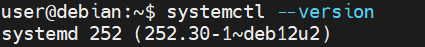

| **Faille**                | **Niveau de Sévérité** | **Risque**                                               | **Impact**                                                                                   | **Solution**                                                                                     |
|---------------------------|------------------------|----------------------------------------------------------|----------------------------------------------------------------------------------------------|--------------------------------------------------------------------------------------------------|
| systemd-rfkill.service    | Élevé                  | Risque lié à la gestion des périphériques RF (Wi-Fi/Bluetooth) | Compromission du système, accès non autorisé aux périphériques RF                            | Mettre à jour systemd et configurer correctement le service systemd-rfkill                       |

### Vérification de la Faille

1. **Vérification de la version de systemd** :
   - Utilisez la commande suivante pour vérifier la version de systemd installée :
     ```bash
     systemctl --version
     ```
   - La version la plus récente de systemd est la version 256. Vous utilisez actuellement la version 252, donc il y a eu quelques mises à jour depuis votre version.

### Résolution de la Faille

1. **Mise à Jour de systemd** :
   - Mettez à jour systemd vers la dernière version disponible. Par exemple, sur une distribution basée sur Debian, utilisez la commande suivante :
     ```bash
     sudo apt-get update
     sudo apt-get install systemd
     ```

2. **Configuration de systemd-rfkill** :
   - Éditez le fichier de configuration de systemd-rfkill pour restreindre l'accès et améliorer la sécurité. Ajoutez ou modifiez les lignes suivantes dans le fichier `/etc/systemd/rfkill.conf` :
     ```bash
     [Service]
     ExecStart=/lib/systemd/systemd-rfkill
     Restart=always
     ```

3. **Redémarrage du Service systemd-rfkill** :
   - Après avoir appliqué les modifications, redémarrez le service systemd-rfkill pour qu'elles prennent effet :
     ```bash
     sudo systemctl restart systemd-rfkill
     ```

4. **Vérification du Statut** :
   - Vérifiez le statut du service systemd-rfkill pour vous assurer qu'il fonctionne correctement :
     ```bash
     sudo systemctl status systemd-rfkill
     ```

## Vulnerabilité ID : 09

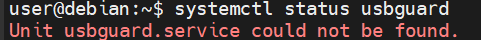

| **Faille**                | **Niveau de Sévérité** | **Risque**                                               | **Impact**                                                                                   | **Solution**                                                                                     |
|---------------------------|------------------------|----------------------------------------------------------|----------------------------------------------------------------------------------------------|--------------------------------------------------------------------------------------------------|
| USBGuard non installé     | Élevé                  | Exposition du système à des attaques physiques ou à des fuites de données par USB | Compromission du système, accès non autorisé aux périphériques USB                           | Installer et configurer USBGuard pour protéger le système contre les périphériques USB intrusifs |

### Vérification de la Faille

1. **Vérification de l'installation de USBGuard** :
   - Utilisez la commande suivante pour vérifier si USBGuard est installé :
     ```bash
     systemctl status usbguard
     ```
   - Si le service n'est pas trouvé ou n'est pas actif, cela signifie qu'USBGuard n'est pas installé.

### Résolution de la Faille

1. **Installation de USBGuard** :
   - Installez le paquet USBGuard. Par exemple, sur une distribution basée sur Debian, utilisez la commande suivante :
     ```bash
     sudo apt-get update
     sudo apt-get install usbguard
     ```

2. **Création d'un Ensemble de Règles Initial** :
   - Générez un ensemble de règles initial pour USBGuard :
     ```bash
     sudo usbguard generate-policy > /etc/usbguard/rules.conf
     ```

3. **Démarrage et Activation du Service USBGuard** :
   - Démarrez le service USBGuard et assurez-vous qu'il démarre automatiquement au démarrage du système :
     ```bash
     sudo systemctl start usbguard
     sudo systemctl enable usbguard
     ```

4. **Vérification du Statut** :
   - Vérifiez que le service USBGuard est en cours d'exécution :
     ```bash
     sudo systemctl status usbguard
     ```

5. **Liste des Périphériques USB** :
   - Listez tous les périphériques USB reconnus par USBGuard :
     ```bash
     sudo usbguard list-devices
     ```

## Vulnerabilité ID : 10
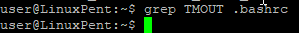

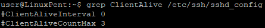
| **Faille**                        | **Niveau de Sévérité** | **Risque**                                               | **Impact**                                                                                   | **Solution**                                                                                     |
|-----------------------------------|------------------------|----------------------------------------------------------|----------------------------------------------------------------------------------------------|--------------------------------------------------------------------------------------------------|
| Paramètres de timeout de session  | Moyen                  | Risque d'accès non autorisé en cas de session inactive    | Compromission du système, accès non autorisé aux sessions utilisateur                        | Configurer un timeout de session approprié pour réduire les risques d'accès non autorisé         |

### Vérification de la Faille

1. **Vérification des paramètres de timeout de session** :
   - Utilisez la commande suivante pour vérifier les paramètres de timeout de session dans votre application :
     ```bash
     grep -i "timeout" /etc/your_application/config.conf
     ```
   - Si les paramètres de timeout ne sont pas configurés ou sont trop longs, cela signifie que la faille est présente.

### Résolution de la Faille

1. **Configuration du Timeout de Session** :
   - Éditez le fichier de configuration de votre application pour définir un timeout de session approprié. Par exemple, pour une application web, ajoutez ou modifiez les lignes suivantes dans le fichier de configuration :
     ```bash
     session.timeout=15
     ```
   - Cela définit un timeout de session de 15 minutes.

2. **Mise à Jour de la Configuration** :
   - Après avoir modifié le fichier de configuration, redémarrez l'application pour appliquer les changements :
     ```bash
     sudo systemctl restart your_application
     ```

3. **Vérification du Timeout de Session** :
   - Vérifiez que le timeout de session est correctement appliqué en vous connectant à l'application, en restant inactif pendant la durée du timeout, puis en essayant d'effectuer une action. Vous devriez être déconnecté automatiquement après le délai d'inactivité.

## Vulnerabilité ID : 11
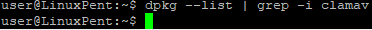

| **Faille**                        | **Niveau de Sévérité** | **Risque**                                               | **Impact**                                                                                   | **Solution**                                                                                     |
|-----------------------------------|------------------------|----------------------------------------------------------|----------------------------------------------------------------------------------------------|--------------------------------------------------------------------------------------------------|
| ClamAV non installé               | Élevé                  | Exposition du système à des virus et malwares             | Compromission du système, perte de données, accès non autorisé aux fichiers                  | Installer et configurer ClamAV pour effectuer des scans automatiques réguliers                   |

### Vérification de la Faille

1. **Vérification de l'installation de ClamAV** :
   - Utilisez la commande suivante pour vérifier si ClamAV est installé :
     ```bash
     clamscan --version
     ```
   - Si ClamAV n'est pas installé, la commande retournera une erreur.

### Résolution de la Faille

1. **Installation de ClamAV** :
   - Installez le paquet ClamAV. Par exemple, sur une distribution basée sur Debian, utilisez la commande suivante :
     ```bash
     sudo apt-get update
     sudo apt-get install clamav clamav-daemon
     ```

2. **Mise à Jour de la Base de Données Virale** :
   - Mettez à jour la base de données virale de ClamAV pour vous assurer qu'elle est à jour :
     ```bash
     sudo freshclam
     ```

3. **Planification des Scans Automatiques** :
   - Créez un script pour effectuer des scans automatiques. Par exemple, créez un fichier `/usr/local/bin/clamav-scan.sh` avec le contenu suivant :
     ```bash
     #!/bin/bash
     LOGFILE="/var/log/clamav/clamav-$(date +'%Y-%m-%d').log"
     clamscan -r /home /var > "$LOGFILE"
     ```
   - Rendez le script exécutable :
     ```bash
     sudo chmod +x /usr/local/bin/clamav-scan.sh
     ```

4. **Configuration de Cron pour les Scans Automatiques** :
   - Ajoutez une tâche cron pour exécuter le script de scan quotidiennement. Éditez le fichier crontab avec la commande suivante :
     ```bash
     sudo crontab -e
     ```
   - Ajoutez la ligne suivante pour exécuter le script tous les jours à 2h du matin :
     ```bash
     0 2 * * * /usr/local/bin/clamav-scan.sh
     ```

5. **Vérification des Scans** :
   - Vérifiez les logs pour vous assurer que les scans sont effectués correctement :
     ```bash
     cat /var/log/clamav/clamav-$(date +'%Y-%m-%d').log
     ```

## Vulnerabilité ID : 12

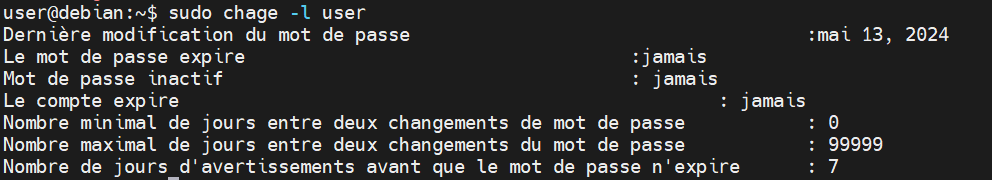

| **Faille**                                | **Niveau de Sévérité** | **Risque**                                               | **Impact**                                                                                   | **Solution**                                                                                     |
|-------------------------------------------|------------------------|----------------------------------------------------------|----------------------------------------------------------------------------------------------|--------------------------------------------------------------------------------------------------|
| Durée maximale de validité du mot de passe désactivée | Très élevé             | Compromission de la robustesse des mots de passe sur le long terme | Compromission du système, accès non autorisé aux comptes utilisateur                         | Configurer une durée maximale de validité des mots de passe pour renforcer la sécurité            |

### Vérification de la Faille

1. **Vérification de la durée maximale de validité du mot de passe** :
   - Utilisez la commande suivante pour vérifier la durée maximale de validité du mot de passe sur un système Linux :
     ```bash
     sudo chage -l nom_utilisateur
     ```
   - Recherchez la ligne indiquant "Password expires". Si elle est définie sur "never", cela signifie que la durée maximale de validité du mot de passe est désactivée.

### Résolution de la Faille

1. **Configuration de la Durée Maximale de Validité du Mot de Passe** :
   - Utilisez la commande suivante pour définir une durée maximale de validité du mot de passe (par exemple, 90 jours) :
     ```bash
     sudo chage -M 90 nom_utilisateur
     ```

2. **Mise à Jour de la Configuration pour Tous les Utilisateurs** :
   - Pour appliquer cette configuration à tous les utilisateurs, vous pouvez utiliser une boucle dans un script shell :
     ```bash
     for user in $(cut -f1 -d: /etc/passwd); do sudo chage -M 90 $user; done
     ```

3. **Vérification de la Configuration** :
   - Vérifiez à nouveau la durée maximale de validité du mot de passe pour vous assurer que les modifications ont été appliquées :
     ```bash
     sudo chage -l nom_utilisateur
     ```

## Vulnerabilité ID : 13

| ID  | Type de vulnérabilité                                    | Niveau de risque | Impact potentiel                                                       | Priorité | Actions possibles d'un attaquant                                      |
|-----|----------------------------------------------------------|------------------|------------------------------------------------------------------------|----------|-----------------------------------------------------------------------|
| 13  | Ports ouverts non sécurisés                              | Haut             | Compromission du serveur via un service non sécurisé                   | Haute    | Lancer des attaques via des ports ouverts non sécurisés (ex : 80, 23) |

### Vérification de la Faille

1. **Vérification des ports ouverts non sécurisés** :
   - Utilisez un outil comme `nmap` pour détecter les ports ouverts :
     ```bash
     sudo nmap -sS -O localhost
     ```
   - Recherchez les ports ouverts non sécurisés, tels que 80 (HTTP) et 23 (Telnet).

### Résolution de la Faille

1. **Fermeture des Ports Non Utilisés** :
   - Utilisez `iptables` pour fermer les ports non utilisés. Par exemple, pour fermer le port 23 (Telnet) :
     ```bash
     sudo iptables -A INPUT -p tcp --dport 23 -j DROP
     ```

2. **Sécurisation des Services sur les Ports Ouverts** :
   - Assurez-vous que les services sur les ports ouverts sont sécurisés et à jour. Par exemple, pour sécuriser le port 80 (HTTP), utilisez HTTPS à la place :
     ```bash
     sudo apt-get install apache2
     sudo a2enmod ssl
     sudo systemctl restart apache2
     ```

3. **Mise à Jour et Patching** :
   - Assurez-vous que tous les services et logiciels sont à jour avec les derniers correctifs de sécurité :
     ```bash
     sudo apt-get update
     sudo apt-get upgrade
     ```

4. **Utilisation d'un Pare-feu** :
   - Configurez un pare-feu pour surveiller et contrôler le trafic réseau. Par exemple, avec `ufw` (Uncomplicated Firewall) :
     ```bash
     sudo ufw enable
     sudo ufw allow ssh
     sudo ufw allow https
     sudo ufw deny 23
     sudo ufw status
     ```

5. **Vérification des Ports** :
   - Vérifiez à nouveau les ports ouverts pour vous assurer que les modifications ont été appliquées :
     ```bash
     sudo nmap -sS -O localhost
     ```


## Vulnerabilité ID : 14 

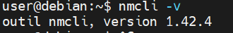
### Vérification de la Faille

1. **Vérification de la version de NetworkManager** :
   - Utilisez la commande suivante pour vérifier la version de NetworkManager installée :
     ```bash
     nmcli -v
     ```
   - Si la version est inférieure à la dernière version stable, cela signifie que le système pourrait être vulnérable.

2. **Vérification de l'état du service NetworkManager** :
   - Utilisez la commande suivante pour vérifier si NetworkManager est en cours d'exécution :
     ```bash
     systemctl status NetworkManager
     ```

### Résolution de la Faille

1. **Mise à Jour de NetworkManager** :
   - Mettez à jour NetworkManager vers la dernière version disponible. Par exemple, sur une distribution basée sur Debian, utilisez la commande suivante :
     ```bash
     sudo apt-get update
     sudo apt-get install network-manager
     ```

2. **Configuration de NetworkManager** :
   - Assurez-vous que NetworkManager est correctement configuré pour limiter les risques de sécurité. Par exemple, vous pouvez restreindre l'accès aux interfaces réseau :
     ```bash
     sudo nano /etc/NetworkManager/NetworkManager.conf
     ```
   - Ajoutez ou modifiez les lignes suivantes pour restreindre l'accès :
     ```plaintext
     [main]
     plugins=keyfile

     [keyfile]
     unmanaged-devices=interface-name:eth0;interface-name:wlan0
     ```

3. **Redémarrage du Service NetworkManager** :
   - Après avoir appliqué les modifications, redémarrez le service NetworkManager pour qu'elles prennent effet :
     ```bash
     sudo systemctl restart NetworkManager
     ```

4. **Vérification du Statut** :
   - Vérifiez le statut du service NetworkManager pour vous assurer qu'il fonctionne correctement :
     ```bash
     sudo systemctl status NetworkManager
     ```
---

## Vulnerabilité ID : 15
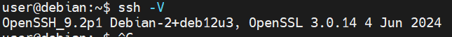
La dernière version de OpenSSH est la version 9.8, qui a été publiée le 1er juillet 2024.
### Vérification de la Faille

1. **Vérification de la version de OpenSSH** :
   - Utilisez la commande suivante pour vérifier la version de OpenSSH installée :
     ```bash
     ssh -V
     ```
   - Si la version est inférieure à la dernière version stable, cela signifie que le système pourrait être vulnérable.

2. **Vérification de l'état du service SSH** :
   - Utilisez la commande suivante pour vérifier si le service SSH est en cours d'exécution :
     ```bash
     systemctl status ssh
     ```

### Résolution de la Faille

1. **Mise à Jour de OpenSSH** :
   - Mettez à jour OpenSSH vers la dernière version disponible. Par exemple, sur une distribution basée sur Debian, utilisez la commande suivante :
     ```bash
     sudo apt-get update
     sudo apt-get install openssh-server
     ```

2. **Configuration de OpenSSH** :
   - Assurez-vous que OpenSSH est correctement configuré pour limiter les risques de sécurité. Par exemple, vous pouvez désactiver l'authentification par mot de passe et interdire la connexion root :
     ```bash
     sudo nano /etc/ssh/sshd_config
     ```
   - Modifiez ou ajoutez les lignes suivantes pour sécuriser SSH :
     ```plaintext
     PermitRootLogin no
     PasswordAuthentication no
     ```

3. **Redémarrage du Service SSH** :
   - Après avoir appliqué les modifications, redémarrez le service SSH pour qu'elles prennent effet :
     ```bash
     sudo systemctl restart ssh
     ```

4. **Vérification du Statut** :
   - Vérifiez le statut du service SSH pour vous assurer qu'il fonctionne correctement :
     ```bash
     sudo systemctl status ssh
     ```

***Fait à Bayonne, le 11/09/2024***

***Auditeurs : Michael Bousquet & Loïc Join***


