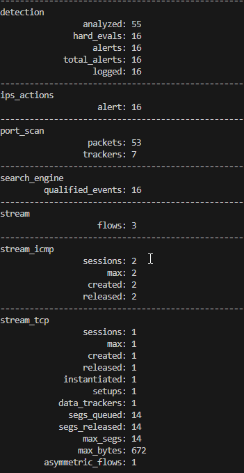

# Conf carte reseau

## Activation du mode promiscuous

ip link set dev ens18 promisc on

## Configuration de l'offload

ip link show ens18
apt install ethtool 
ethtool -k ens18 |grep receive-offload
ethtool -K ens18 gro off lro off
ethtool -k ens18 | grep receive-offload

# Conf auto en service

## Création du fichier de service

nano /etc/systemd/system/snort3-nic.service

[Unit]
Description=Set Snort 3 NIC in promiscuous mode and Disable GRO, LRO on boot
After=network.target

[Service]
Type=oneshot
ExecStart=/usr/sbin/ip link set dev ens18 promisc on
ExecStart=/usr/sbin/ethtool -K ens18 gro off lro off
TimeoutStartSec=0
RemainAfterExit=yes

[Install]
WantedBy=default.target

## Activation et redémarrage du service

systemctl daemon-reload
systemctl start snort3-nic.service 
systemctl enable --now snort3-nic.service

# Regles perso

## Creation Regles
cd /root/snort3/lua/
mkdir rules

nano /root/snort3/lua/rules/local.rules

# ----------------
# LOCAL RULES
# ----------------
# This file intentionally does nots come with signatures. Put your local additions here.

alert icmp any any -> any any (msg:"!!! ICMP Alert !!!";sid:1000001;rev:1;classtype:icmpevent;)

## Log

mkdir /var/log/snort
chmod 777 /var/log/snort

## Modif conf snort

nano /root/snort3/lua/snort.lua

---------------------------------------------------------------------------
-- 7. configure outputs
---------------------------------------------------------------------------

alert_fast =
{
    file = true,
    limit = 100000
}

alert_full =
{
    file = true,
    limit = 100000
}

snort -c /root/snort3/lua/snort.lua -R /root/snort3/lua/rules/local.rules -i ens18 -A alert_fast -l /var/log/snort

## Screen de deux ping 

    

