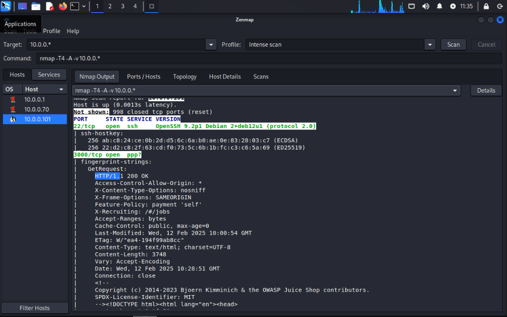
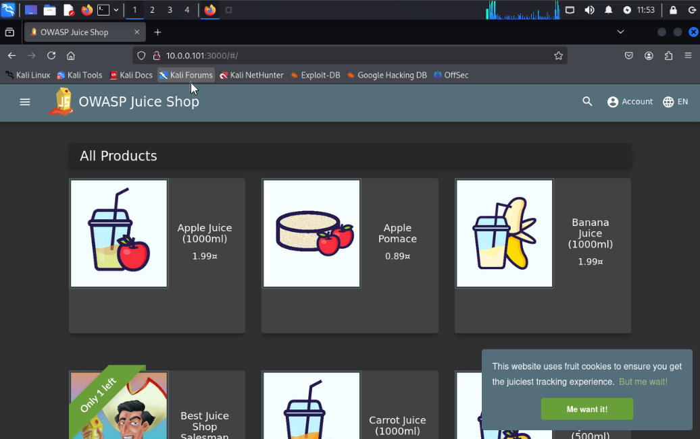
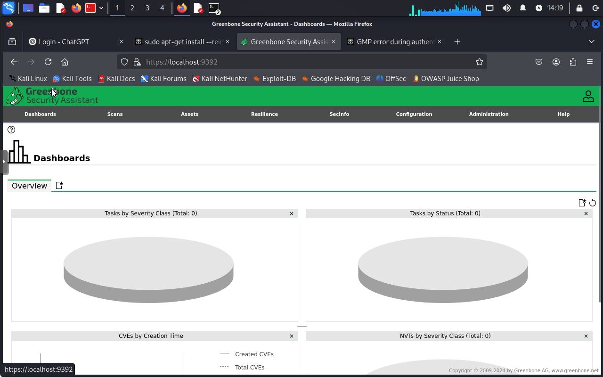
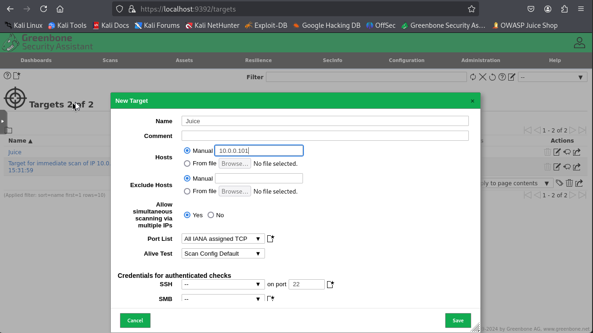
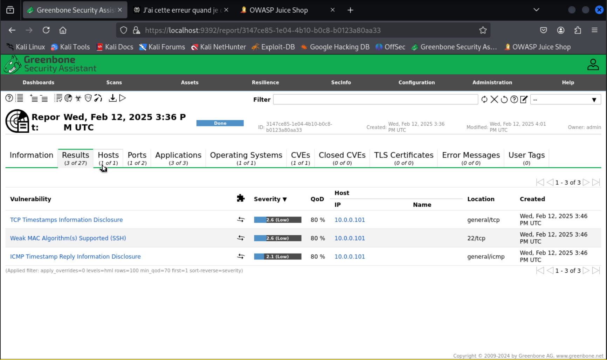

# Pentest Juice Shop

## Reconnaissance : Identifier l'adresse IP ou le nom de domaine de l'instance Juice Shop dans le réseau cible.

Ip machine cible via nmap -> 10.0.0.101

## Scan des ports : 

nmap -sn 10.0.0.101/24

Port ouvert :
22 pour ssh et 3000 pour l'app

    

## Accès à l'application : Se connecter à l'URL et explorer l'app

    

## Déploiement d'OpenVAS

### Install 
sudo apt install openvas
### Chmod Fichier log 
sudo chmod 666 /var/log/gvm/openvas.log
### Synchronisation des flux de données
sudo greenbone-feed-sync
### Initialisation
sudo gvm-setup
### Vérification de l'installation
sudo gvm-check-setup
### Initialisation
sudo gvm-setup
### Lancement
sudo gvm-start
### Accès à l'interface (login)
https://localhost:9392

    

- Ajouter la cible dans OpenVAS

Configuration -> Target

    

- Scanner la cible 

Scans -> New Task 

    

- Résultats du premier Scan

    

- Analyse du code source : Examiner le code source de l'application, en particulier le fichier main.js, pour des informations utiles.

Télécharger le site :

wget -r http://10.0.0.101:3000

Maintenant on peut lire le code source avec un éditeur de code.